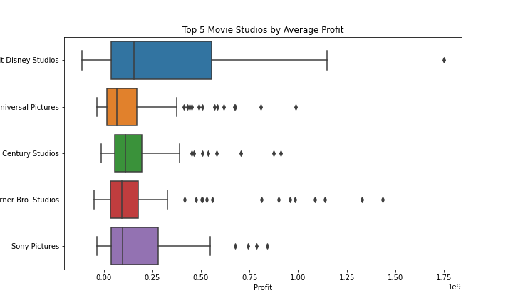
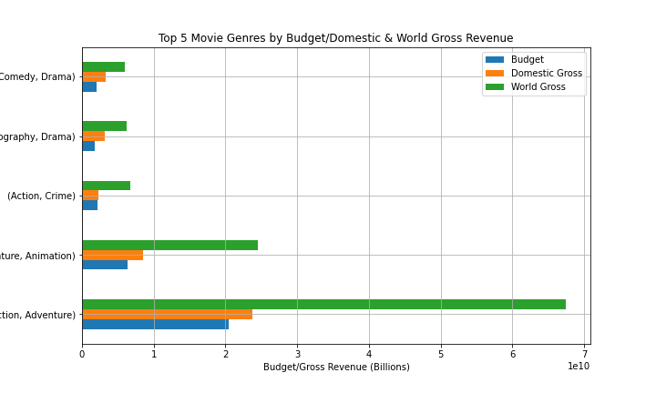
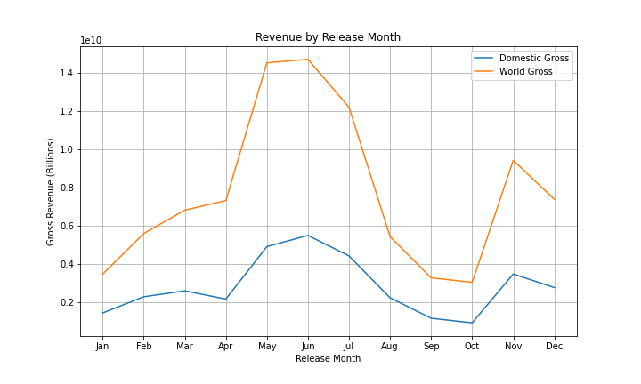

# Microsoft Movie Studio Project

**Author**: [Nat Berryman](https://github.com/natberr)

## Overview

This project analysed over 1000 movies to identify what makes a successful movie. The analysis shows that most profitable movie studios, highest grossing genres and the best month to release certain movies. Microsoft can use this analysis as a starting point on what movies to produce however ongoing analysis will be required as there a multiple metrics which can be evaluated in order to make a succesful movie.

## Business Problem

The business problem that I set out to solve was, how can Microsoft's venture into the movie making industry be successful?

In order to solve this problem, I intended to find answer for the following questions:
1. What are the highest grossing production studios?
2. What is the highest grossing movie genres?
3. What is the most successful release date patterns?
4. Do rating or movie length impact revenue?
5. What other metrics can be evaluated to define what makes a good movie?

## Data

The data used for this analysis was the Title Basics and Title Ratings from IMDB, Movie Gross from Box Office Mojo and Movie Budgets from The Numbers. The sets represent the total movies number of movies released over a determined timeframe, the titles and production studios, the rating scores, primary and sub-genres along with the domestic and world gross revenue. It was identifed that these sets had the data required to make meaningful recommendations to the head of Microsofts movie studio.

## Methods

I started by merging the title basics, title ratings, movie budgets and movie gross data.
Once merged I dropped irrelevant columns and removed duplidate movie titles.
Then I split out the genres into primary genre columns and sub-genre columns and converted the dates into columns for easier evaluation.  

**Data Cleaning**
- Release date data was split to month/year and converted it to datetime.
- Genre data was also split to primary genre and sub genre.
- Production Budget, Domestic Gross and Worldwide Gross data was converted to integers.
- Profit/Loss and Profit/Loss % columns were added by subtracting the production budget from worldwide gross.

**I then followed the below steps:**

- Irrelevant columns were then deleted.
- Investigated if there were any duplicate under movie column.
- Identified any missing values and replaced with '-' or zero.
- Identified the release year range for the data and removed anything prior to 2010.
- Correlated the average rating and runtime against gross data. Both columns were deemed irellevent and were removed.
- Data set was saved to data folder for analysis. I followed this by created a table of the highest world wide grossing movie by year and noticed 7 were Action movies and 2 were Adventure movies.

## Results

To assist in making the solid recommendations to Microsoft, first I grouped together the most profitable movie studios and kept to the top 5. It was found that BV studio was the most profitable by total gross. After some quick googling, I noticed that BV now came under Walt Disney Studios so the title was updated in the graph to reflect this update.



After noting that Action was the top movie genre in 7 out 9 years previously, I analysed further to include both primary genre and sub-genre. It was clear that these movie genres outperform all other genres by a considerable amount, however they require significant investment.



Finally I focused on the Action movie release dates to identify any patterns or favourable release months. It was determined that May and June are the best time to release these movies.



## Conclusions

Following the evalutation the below was confirmed;

1. The top 5 movie studios are Disney, Universal, 20th Century, Warner Bros and Sony.
2. Action / Adventure movies are the highest grossing.
3. The best months to release these movies is across May and June.
4. Ratings and movie length do not correlate with gross revenue.
5. No additional metrics stood out, however further analysis could be done on the above points or more data sets.

It is indicated that Microsoft should explore making action/adventure movies as a first step into their new venture. However it must be noted these movie genres require significant investment.

Further analysis into established movie studios could be undertaken such as franchise performance e.g. Marvel, DC, James Bond and Fast & Furious.

While the ratings do not correlate with gross revenue, it may be useful to conduct further analysis on this metric in profit/loss percentage values.

**Three recommendations resulting from the analysis are:**
- Explore partnership opportunities with established movie studios, much like Disney and Sony with Spider-Man movies.
- Investigate making Action/Adventure movies.
- Releasing these movies across May/June.

**Next Steps:**
- Analyse streaming services performance along with box office data e.g. Netflix, Amazon Prime.
- Explore smaller budget and/or foreign language films markets as they still may yield attractive profits.
- There is a possiblity the high grossing movie studios are not interested in partnership opportunities so it may be worth approaching smaller companies.

## For More Information

Please review the full analysis in [my Jupyter Notebook](http://localhost:8888/notebooks/Desktop/AcademyXI/Project1/dsc-project-template/Microsoft%20Movie%20Studio%20Project.ipynb) or my [presentation pack](https://github.com/natberr/Project1/blob/main/Microsoft%20Movie%20Studio%20Project%20Presentation.pdf).

For any additional questions, please contact **Nat Berryman - nathaniel.berryman@gmail.com**

## Repository Structure

```
├── README.md
├── Microsoft Movie Studio Project.ipynb
├── Microsoft Movie Studio Project Presentation.pdf
├── data
└── images
```
